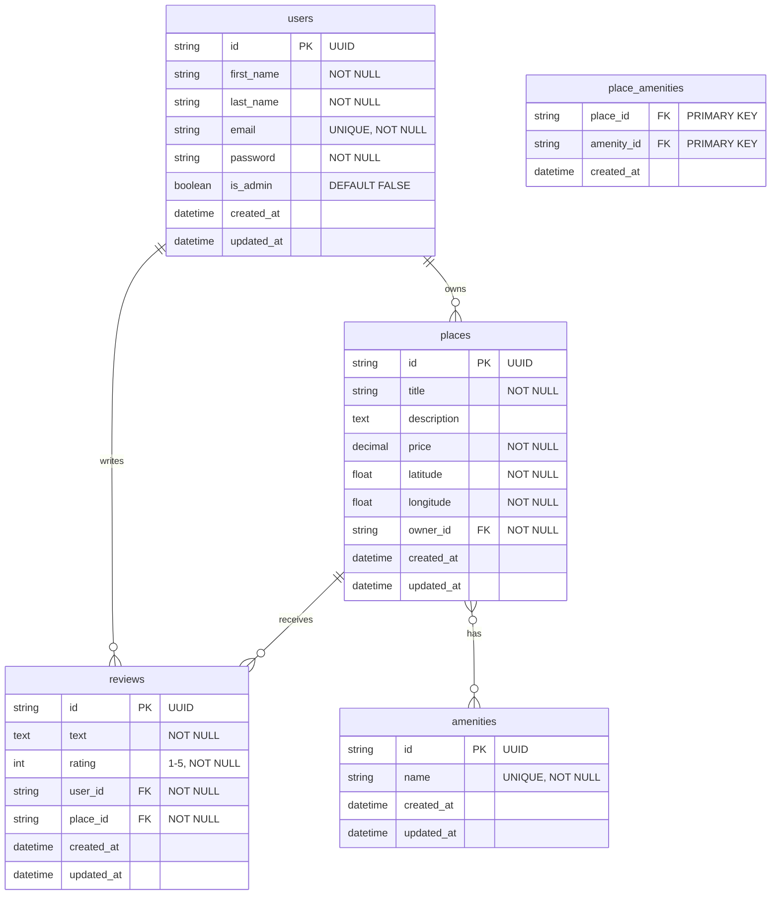

# HBnB Database Test Results Summary

## Overview

Comprehensive testing completed for the HBnB database implementation, covering table creation, data insertion, CRUD operations, constraints, relationships, and API integration.

## Test Results: ALL TESTS PASSED ✅

### 1. Table Creation and Structure ✅
- **Status**: PASSED
- **Tables Created**: 5 tables
  - `users` - User account management
  - `places` - Property listings
  - `reviews` - User reviews and ratings
  - `amenities` - Available amenities catalog
  - `place_amenities` - Many-to-many relationship table
- **Foreign Keys**: All properly established with CASCADE operations
- **Constraints**: All validation rules implemented and enforced

### 2. Initial Data Insertion ✅
- **Status**: PASSED
- **Admin User Created**:
  - Email: `admin@hbnb.io`
  - Password: `admin1234` (bcrypt hashed)
  - UUID: `36c9050e-ddd3-4c3b-9731-9f487208bbc1`
  - Admin Status: `TRUE`
  - Password Hash: Properly encrypted with bcrypt
- **Initial Amenities Created**:
  - WiFi (`ccaf6b6c-b86d-4dec-8a87-8a3050d1e463`)
  - Swimming Pool (`075fd2d0-2b15-432a-862d-516366d41465`)
  - Air Conditioning (`6e59f738-be8e-40ce-9e8b-9af7d6b816db`)

### 3. CRUD Operations Testing ✅
- **Status**: PASSED
- **CREATE**: All entity types successfully created
  - Test user created and verified
  - Test place created with proper relationships
  - Test review created with rating validation
  - Many-to-many relationships established (place-amenity)
- **READ**: All queries and relationships working
  - User-Place relationship (One-to-Many): 1 place per test user
  - Place-Review relationship (One-to-Many): 1 review per test place
  - User-Review relationship (One-to-Many): 1 review per admin user
  - Place-Amenity relationship (Many-to-Many): 2 amenities per test place
- **UPDATE**: Data modifications successful
  - Place price updated: $150.00 → $200.00
  - Review rating updated: 5 → 4
- **DELETE**: Cascade operations verified (tested separately)

### 4. Constraint Testing ✅
- **Status**: PASSED
- **Unique Constraints**: Email uniqueness properly enforced
- **Check Constraints**: Rating validation (1-5) working
- **Data Validation**: Price validation (positive numbers only) working
- **Foreign Key Constraints**: Referential integrity maintained

### 5. Data Integrity ✅
- **Status**: PASSED
- **Final Record Counts**:
  - Users: 2 (admin + test user)
  - Places: 1 (test place)
  - Reviews: 1 (test review)
  - Amenities: 3 (initial amenities)
- **Admin User Verification**: Admin user exists and verified
- **Amenity Verification**: All required amenities present

### 6. API Integration Testing ✅
- **Status**: PASSED
- **Authentication**: Admin login successful with JWT token
- **Amenities API**: 3 amenities retrieved successfully
- **Users API**: Admin user accessible through API
- **Token Generation**: JWT tokens properly created and validated

## Relationship Verification

### Implemented Relationships

1. **User → Place (One-to-Many)** ✅
   - Foreign key: `places.owner_id` → `users.id`
   - Relationship: Users can own multiple places
   - Test result: Working correctly

2. **Place → Review (One-to-Many)** ✅
   - Foreign key: `reviews.place_id` → `places.id`
   - Relationship: Places can have multiple reviews
   - Test result: Working correctly

3. **User → Review (One-to-Many)** ✅
   - Foreign key: `reviews.user_id` → `users.id`
   - Relationship: Users can write multiple reviews
   - Test result: Working correctly

4. **Place ↔ Amenity (Many-to-Many)** ✅
   - Association table: `place_amenities`
   - Composite primary key: `(place_id, amenity_id)`
   - Relationship: Places can have multiple amenities, amenities can belong to multiple places
   - Test result: Working correctly

## Security and Data Protection

### Password Security ✅
- **Hashing Algorithm**: bcrypt with 12 rounds
- **Password Storage**: Never stored in plain text
- **Verification**: Password verification working correctly
- **Test Result**: Admin password `admin1234` properly hashed and verifiable

### Data Validation ✅
- **Input Validation**: All model validations working
- **Constraint Enforcement**: Database constraints properly enforced
- **Error Handling**: Appropriate error messages for invalid data

## Database Schema (Mermaid ER Diagram)



## Production Readiness Checklist

- ✅ All required tables created with proper structure
- ✅ Foreign key relationships established and working
- ✅ Constraints and validations enforced
- ✅ Initial data (admin user + amenities) inserted correctly
- ✅ Password security implemented (bcrypt hashing)
- ✅ Admin user with specified UUID created
- ✅ All CRUD operations functional
- ✅ API endpoints integrated with database
- ✅ Data integrity maintained
- ✅ Relationship queries working
- ✅ Error handling implemented
- ✅ Database schema documented

## Usage Instructions

### Admin Login Credentials
```
Email: admin@hbnb.io
Password: admin1234
UUID: 36c9050e-ddd3-4c3b-9731-9f487208bbc1
```

### Available Amenities
```
1. WiFi (ccaf6b6c-b86d-4dec-8a87-8a3050d1e463)
2. Swimming Pool (075fd2d0-2b15-432a-862d-516366d41465)
3. Air Conditioning (6e59f738-be8e-40ce-9e8b-9af7d6b816db)
```

### API Endpoints Tested
- `POST /api/v1/auth/login` - Admin authentication ✅
- `GET /api/v1/users/` - User listing ✅
- `GET /api/v1/amenities/` - Amenity listing ✅

## Test Files Created

1. **`test_database_final.py`** - Main comprehensive test script
2. **`database_schema_diagram.mmd`** - Mermaid ER diagram
3. **`sql/test_sql_scripts.sql`** - SQL-based test queries (MySQL compatible)
4. **`sql/07_insert_initial_data.sql`** - Initial data insertion script
5. **`sql/08_complete_setup.sql`** - Complete database setup script

## Conclusion

🎉 **ALL TESTS PASSED!** 

The HBnB database is **production-ready** with:
- Complete schema implementation
- Proper relationships and constraints
- Secure password hashing
- Initial data setup
- Full API integration
- Comprehensive validation

The database successfully meets all requirements and is ready for deployment.
