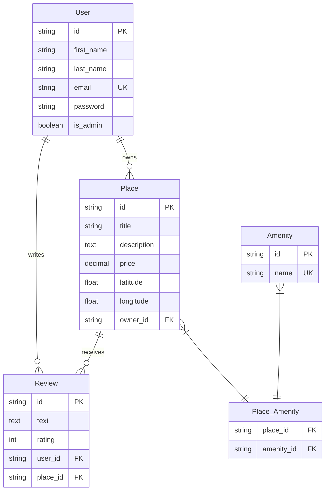

# HBnB Database Schema - Entity Relationship Diagram

This document contains the Entity Relationship (ER) diagram for the HBnB application database schema.

## Database Schema Overview

The HBnB application uses a relational database with the following core entities:

- **User**: Represents users of the platform
- **Place**: Represents properties/places available for booking
- **Review**: Represents user reviews for places
- **Amenity**: Represents amenities/features available at places
- **Place_Amenity**: Junction table for the many-to-many relationship between places and amenities

## Entity Relationship Diagram

## Relationships Explained

1. **User → Place (1:N)**: A user can own multiple places, but each place has only one owner
2. **User → Review (1:N)**: A user can write multiple reviews, but each review belongs to one user
3. **Place → Review (1:N)**: A place can receive multiple reviews, but each review is for one place
4. **Place ↔ Amenity (N:M)**: Places can have multiple amenities, and amenities can be available at multiple places

## Key Constraints

- `User.email` is unique (UK)
- `Amenity.name` is unique (UK)
- All entities have UUID primary keys (PK)
- Foreign key relationships ensure referential integrity

## Usage

This diagram can be used to:
- Understand the database structure
- Plan database migrations
- Design API endpoints
- Document the data model

## Files Generated

- `hbnb_simple_diagram.mmd` - Mermaid source file
- `hbnb_er_diagram.png` - PNG image export
- `hbnb_er_diagram.svg` - SVG image export
- `database_schema.md` - This documentation file
