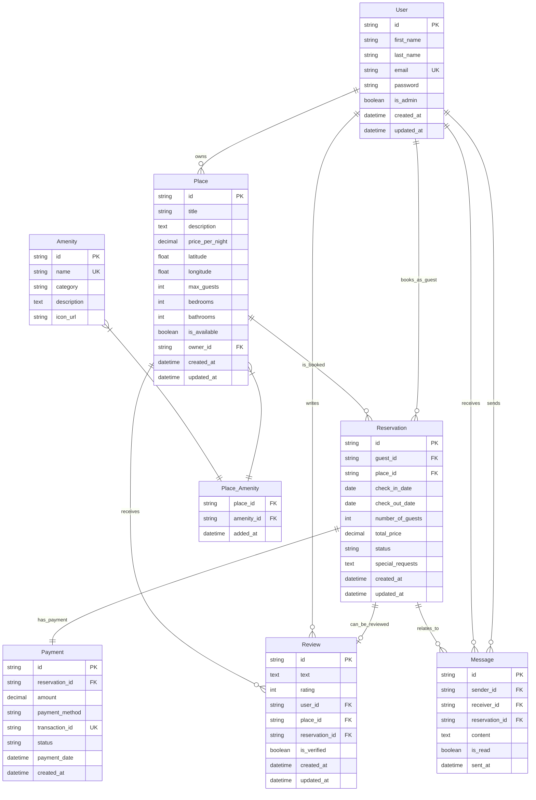

# Extended HBnB Database Schema - With Booking Functionality

This document demonstrates an extended Entity Relationship (ER) diagram for the HBnB application, including booking/reservation functionality and enhanced features.

## 🆕 New Entities Added

### **Reservation (Booking)**
- **Purpose**: Central entity for managing bookings between guests and places
- **Key Features**: 
  - Tracks booking dates, guest count, pricing
  - Status management (pending, confirmed, cancelled, completed)
  - Special requests handling

### **Payment**
- **Purpose**: Handles financial transactions for reservations
- **Key Features**:
  - Multiple payment methods support
  - Transaction tracking and status
  - Unique transaction IDs for security

### **Message**
- **Purpose**: Communication system between users
- **Key Features**:
  - Guest-Host communication
  - Reservation-specific messaging
  - Read status tracking

## Enhanced Entity Relationship Diagram



## 🔗 Key Relationships Explained

### **Core Booking Flow**
1. **User → Reservation (1:N)**: A user can make multiple bookings as a guest
2. **Place → Reservation (1:N)**: A place can have multiple bookings over time
3. **Reservation → Payment (1:1)**: Each reservation has exactly one payment record
4. **Reservation → Review (1:0..1)**: A reservation can optionally have one review after completion

### **Enhanced Review System**
- **Traditional**: User writes review for Place
- **Enhanced**: Review is now linked to a specific Reservation
- **Benefit**: Ensures only actual guests can review, prevents fake reviews

### **Communication System**
- **User ↔ User**: Direct messaging between any users
- **Reservation Context**: Messages can be related to specific bookings
- **Use Cases**: Pre-arrival questions, check-in instructions, issue reporting

## 📊 Business Logic Constraints

### **Reservation Status Flow**
```
pending → confirmed → completed
    ↓         ↓
cancelled   cancelled
```

### **Review Verification**
- `is_verified = true` only when `reservation_id` is not null
- Only guests who completed their stay can leave verified reviews

### **Payment Requirements**
- Payment must be completed before reservation status changes to "confirmed"
- `transaction_id` ensures no duplicate payments

## 🔍 Advanced Query Examples

### Find all reservations for a place with guest details:
```sql
SELECT r.*, u.first_name, u.last_name, u.email
FROM Reservation r
JOIN User u ON r.guest_id = u.id
WHERE r.place_id = 'place-uuid'
ORDER BY r.check_in_date DESC;
```

### Get verified reviews with reservation context:
```sql
SELECT rv.*, r.check_in_date, r.check_out_date
FROM Review rv
JOIN Reservation r ON rv.reservation_id = r.id
WHERE rv.is_verified = true AND rv.place_id = 'place-uuid';
```

### Check place availability for date range:
```sql
SELECT * FROM Place p
WHERE p.id = 'place-uuid'
AND p.is_available = true
AND p.id NOT IN (
    SELECT place_id FROM Reservation
    WHERE status IN ('confirmed', 'pending')
    AND check_in_date <= 'end-date'
    AND check_out_date >= 'start-date'
);
```

## 🚀 Benefits of This Design

1. **Data Integrity**: Strong foreign key relationships prevent orphaned records
2. **Audit Trail**: Timestamps on all entities for tracking changes
3. **Scalability**: Clear separation of concerns allows independent scaling
4. **Business Logic**: Status fields enable proper workflow management
5. **Communication**: Built-in messaging reduces external dependencies

## 📁 Files Generated

- `hbnb_extended_diagram.mmd` - Mermaid source file
- `hbnb_extended_diagram.png` - PNG image export  
- `hbnb_extended_diagram.svg` - SVG image export
- `extended_database_schema.md` - This comprehensive documentation

## 🔄 Schema Evolution Comparison

| Aspect | Simple Schema | Extended Schema |
|--------|---------------|----------------|
| **Entities** | 5 (User, Place, Review, Amenity, Place_Amenity) | 8 (+Reservation, Payment, Message) |
| **Core Focus** | Basic listings and reviews | Full booking platform |
| **User Roles** | Owner/Reviewer | Owner/Guest/Host |
| **Revenue Model** | Not supported | Payment processing included |
| **Communication** | None | Built-in messaging system |
| **Review Trust** | Basic rating system | Verified reviews from actual stays |
| **Business Logic** | Minimal | Status workflows, availability tracking |
| **Audit Trail** | Limited | Comprehensive timestamps |
| **Scalability** | Good for MVP | Production-ready |

## 🎯 Key Relationship Insights Demonstrated

### **1. Many-to-Many → Junction Table**
- Place ↔ Amenity requires Place_Amenity junction table
- Allows additional metadata (like `added_at` timestamp)

### **2. One-to-One Relationships**  
- Reservation → Payment (each booking has exactly one payment)
- Demonstrates tight coupling for business-critical data

### **3. Self-Referencing Relationships**
- Message table: User can be both sender AND receiver
- Shows how one entity can relate to itself in different roles

### **4. Optional Foreign Keys**
- Review.reservation_id is optional (allows legacy reviews)
- Message.reservation_id is optional (allows general communication)

### **5. Cascading Dependencies**
- Delete User → What happens to their Places/Reservations?
- Delete Place → What happens to active Reservations?
- Proper cascade rules prevent orphaned data

This extended schema demonstrates a production-ready booking platform database design with proper relationships, constraints, and business logic support.
